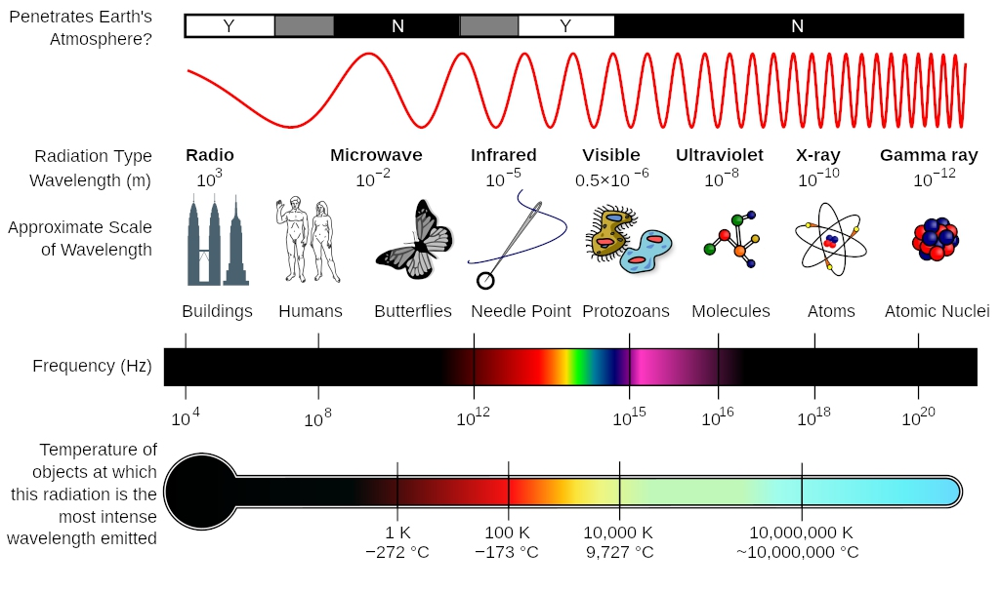
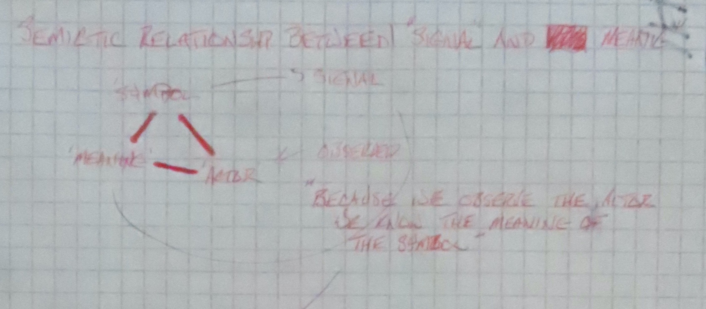
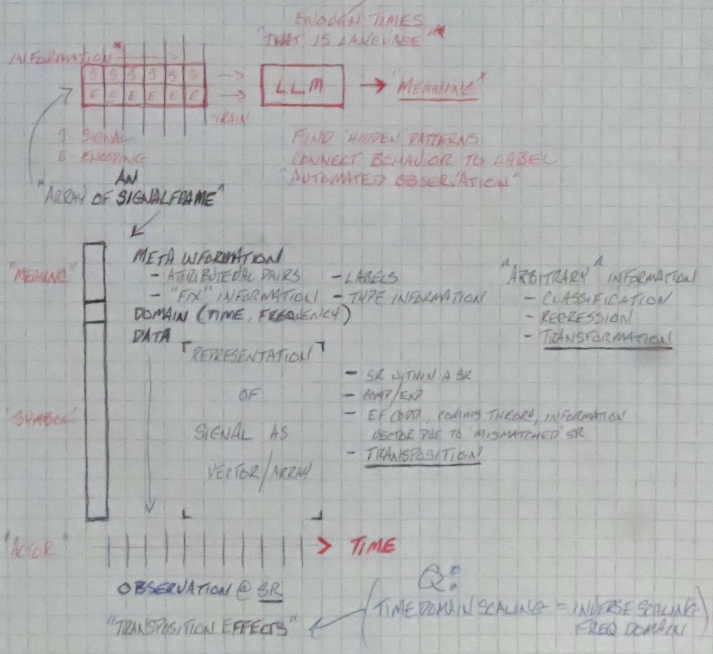

# Signal Semiotics Toolkit

## Overview

This toolkit explores a foundational approach to interpreting electromagnetic (EM) emissions as a form of language.
We frame signal analysis using two core concepts: **transposition** (the act of making signals perceptible) and
**transformation** (the act of making 'symbols' intelligible).
# <H1><FONT COLOR='RED'>TO BE CLEAR, WE ARE AFTER THEY SYMBOL, NOT JUST THE SIGNAL.</FONT></H1>
By treating EM emissions as communicative acts rather than just data or interference, we gain affordances in analysis,
understanding, and potentially interaction. This approach draws from semiotics, signal processing, cognitive electronic
warfare, and information theory.

## Key Concepts

### Transposition
Convert EM emissions into perceptible form:
- Audio rendering 
- Visualization (waveforms, spectrograms, spatial mappings)

### Transformation
Apply data science, algorithms or models to extract meaning:
- Demodulation
- Decoding/Encoding/Tokenization
- Classification & Language modelling
- Behavioral and temporal modeling
- Interfaces for Large Language Models & Macine Learning

### Signal Semiotics
Interpret EM fields as meaningful symbols:
- What system is speaking?
- What behavior is occurring?
- What is the emitter's intent?


># Chapter 1: Toward a Theory of Signal Semiotics
>1. Signal Decomposition
>2. Communications Theory
>## Overview
> Traditionally, signal analysis emphasizes decoding and classification. But if we take a step back, we see that every signal is a communicative act—embedded in a system of meaning.

A theoretical signal can be decomposed into three layers:

1. **Bias**: The structured, persistent signature or fingerprint of the emitter. This includes its choice of frequency, modulation, timing, and behavior. Bias encodes *intent*, *identity*, and *design constraints*. It is the emitter's grammar or dialect.
2. **Variance**: These are the modulations and variations around the bias that convey specific instances of content or behavior. This is where meaning fluctuates and where one can observe the "speech" or message, framed within the emitter's grammar.
3. **Noise**: Traditionally viewed as meaningless, noise can still carry semantic weight—especially when analyzed ecologically. Noise may reflect interference, jamming, multipath effects, or even deception. In a semiotic context, noise may be unintentional expression, intentional obfuscation or ambient context.

When we acknowledge EM emissions as language-like, we potentially gain new understanding about intention, what the signal is 'saying', and even why the signal is present.

Building on communications theory, we model the classical communication triad composed os signal, meaning and actor:

1. **Symbol** the transmitted signal containing information.
2. **Meaning** contextualized understanding of the symbol.
3. **Actor** the interpreter's ressponse to the symbol (action space).

This toolkit intends to instrument the classical model in a manner that builds a foundation for tools that don't just classify signals—they *interpret* them.

># Chapter 2: Transposition & Transformation

>## Overview
> In music, "transposition" means shifting a signal up or down in pitch — a 'frequency' shift. In Signal Semiotics, we're invoking that metaphor in a way that extends beyond music, across the entire EM spectrum. 
> 
> Transposition and Transformation are interrelated concepts. Consider the paralell relation between the time and 
> frequency domain domain, as well as the side-effects of manipulation in either. 
> 

### **Transposition**: Move from A -> B 
Processing the signal to move it from one range of the eelectromagnetic spectrun into another range (visible or audible) for consumption. 
   - time-domain function: 'manipulation of A', 'A x many times', 'timing' or 'timestamp'..
   - implies a collection of 'time-shifted' A.
   - related to frequency domain wrt. a having been the label A for some observable amount of time before being labeled B; a 're-labelling' operation that _may_ be sample rate driven.
   - think "A *", many consecutive "A" moving to "B".

### **Transformation**: Change from A -> B
Processing the signal to modify it from one form into another.
   - Frequency domain function: function of acting on A, the result of processing A, Analysis of A
   - Transformation occuring over time is considered 'modulation'.
   - Related to time domain wrt "being". Because ƒ exists and acts, it presumably "occurs" and produces "B", the result of the occurrence of ƒ. "ƒ is a functional operator acting on A, producing B as an analyzable outcome."
   - think "ƒ(A)"

> In this model, does a signal need to be 'transposed' to be 'tranfsformed'?
> > No. It's typically already done when you get it from a sensor. Also, as we will begin to understand later,
> bugs don't transpose information, it's chemical and it 99x faster to understand.) 


> What about modulation?
> > Distinction from Modulation matters; Modulation does often include changes in frequency (e.g., FM), but what distinguishes modulation is the encoding of information through variation — of amplitude, phase, frequency, or another carrier property.
> Modulation can be a mechanism of Transposition, but not all transpositions are modulations (frequency-domain).


> What about sampling rates?
> > Sampling rate manipulation can be a mechanism for Transformation with side-effects and artifacts.


># Chapter 3: Exploiting the EM Field
>> 1. Electromagnetic Spectrum
> "Humans can perceive a wide range of sounds, typically from 20 Hz to 20,000 Hz, and light wavelengths between 380 and 750 nanometers. This translates to an audible spectrum encompassing a wide range of pitches and a visual spectrum encompassing the colors we see." 
> https://www.google.com/search?q=range+of+human+perception+vision%2C+hearing&oq=range+of+human+perception+vision%2C+hearing&gs_lcrp=EgZjaHJvbWUyBggAEEUYOdIBCTE5MTkxajBqN6gCALACAA&sourceid=chrome&ie=UTF-8
> 
>> 3. "A radio wave is a form of light. This is an unusual thought for many people so we must again revisit the concept of the entire Electromagnetic Spectrum. In the entire spectrum, visible light is only a very small portion of the Electromagnetic Spectrum. X-Rays, for example, are also light but you cannot see them. The same can be said for Infrared light, which can only be detected using special equipment. So a radio wave is just another wave of light that cannot be seen by human eyes. But, they are all around us and they have many common properties with visible light. Radio waves travel at the same speed as light � approximately 186,000 miles per second." -- https://www.universalclass.com/articles/self-help/ham-radio-basics.htm
>>

Discuss Propagation


># Chapter 4: Signal as Function — Symbols, Meaning, and Actors
> 
>1. Communications Theory
>2. Semiotic Relationship Between 'Signal' and Meaning
>3. Symbols vs. Words
>4. 
>5. 
>## Overview
> Fill me in. 

Communications theory defines three major 'roles' in the communication process; a 'symbol', a 'meaning', and an 'actor':
 - '**symbol**': a uniquly recognized, conccensus-driven _pattern_ conveying information. 
 - '**meaning**': an _understanding_ of the symbol as conveyed to the recipient.
 - '**actor**': The _result_ of understanding information contained in the symbol byt  the recipient.

A **'Symbol'** can be defined as a 'structured pattern within a signal'. It posesses a unique form that distinguishes 
it from all other symbols. It is influenced by and is contained in a signal composed of 'bias', 'variance', and 'noise'.

[Bias, Variance and Noise Decomposition discussion]

**'Meaning'** is that which endows a symbol with information to a recipient. In this proposed model of language, 
understanding is driven by concensus, agreement and convention. For instance, consider any commonly understood 'label' 
(e.g. "Tomato") and the corpus of information that the label indicates or contextualizes. In our model, that knowledge 
(understanding) is the **_meaning_** of the symbol '_Tomato_'.

Finally, in this model the **'Actor'** is not the recipient, but the _result_ of acting on **meaning** and the 
information _revealed_. (n.b. In some ccases, this may be framed as a 'choice' to 'act' or 'not to act', as opposed to 
the "result of physically acting" which implies the choice to act).

In this model, because we can observe the '**'actor'**', we could infer the meaning of the symbol. Having enough 
'observations' and 'meanings', we can form a 'language' based on the patterns created in the utilization of the 
symbols as observed. This allow us the opportunity to _reverse-engineer language to understand semiotic (Symbol) 
meaning_ using machine learning to accquire semantic context.

For instance, if an automated agent receives a signal, understands it and then takes 'action', we treat/call that 
result the 'actor'.

> “By observing the behavior of the actor in response to a symbol, we can infer the meaning that the actor has 
> ascribed to it — allowing us to construct a language of signal interpretation through automated observation.”

## Symbols vs. Words
* **Symbol**: A discrete perceptual unit that carries meaning; may or may not be contextually complete. 
* **Word**: A structured collection of symbols intended to form a complete unit of meaning within a context. Words are 
typically used to establish connections between ideas.

In this framework, symbols are the atomic units, while words are composite structures used for higher-order contextual 
communication.

># Toward a Semiotic Language Model
>## Overview
>This chapter explores how perceptual constraints in other taxa may have shaped their 'language' systems, focusing on the 
> capacity to distinguish and utilize symbols. We examine the relationship between sensory bandwidth, symbol resolution, 
> ecological context, and language structure across different classes of organisms. We use this approah to explore the 
> potential for formalizing a mathematical model of language that accounts for these constraints, and the implications 
> for our focus -- artificial systems.

### Perceptual Constraints and Symbol Resolution

Organisms differ in their ability to perceive and resolve symbols due to variations in:

* **Speed of Perception (Hz)**: How quickly symbols can be perceived as discrete units.
* **Bandwidth of Vision and Hearing**: The frequency range over which symbols can be received.
* **Field of View**: The spatial range of visual symbols.
* **Resolution (WPM)**: The rate at which symbols can be processed or interpreted.

These factors define the size of the perceivable symbol set and therefore constrain the linguistic expressiveness of a 
species.

In conjunction we these factors, we posit a functional model:

```math
L = f(S, B, R, C)
```

Where:

* `L`: Communicative language capacity
* `S`: Symbolic resolution (rate of symbol perception)
* `B`: Bandwidth of perception (range of signal frequency)
* `R`: Repertoire size (distinct symbols that can be retained)
* `C`: Cognitive-contextual range (mental states that can be symbolically represented)

For example **Humans** possess moderate `S`, high `B`, high `R`, and high `C`

This model can be used to predict or constrain the form and limits of symbolic systems across domains. As a 'thought 
experiment' let's review this design in the comparative context of common organisms AND a hypothetical Large Language 
Model. We'll start with the animals.

### Species Comparison

A structured table was developed to compare perception-based symbol use across species (Humans, Felidae (Cats), 
Canidae (Dogs), Aves (Birds), Insecta (Insects), Olfactores (Fish), and Machina (AI). Metrics included perceptual speed, 
sensory bandwidth, visual field, symbolic resolution, and extrapolated linguistic structure.

The key insight: Assuming the species has a language, the **species likely adapted their symbolic systems to fit within 
the constraints of their sensory modalities and ecological context**. Birds, for example, may use rapid symbol 
perception abilities (2x Humans) to enable complex calls, even with a narrower auditory bandwidth. Insects may 
rely more heavily on chemical signals due to low visual or auditory bandwidth, though speed of perception is estiamted 
at 4x humans.

These are grouped acccording to their hierarchy in the communications model as discussed above.

#### SYMBOL – Perception of Symbols

| Metric                    | HUMAN         | Felidae       | Canidae       | Aves          | Insecta      | Olfactores    | Machina   |
| ------------------------- | ------------- | ------------- | ------------- | ------------- | ------------ | ------------- | --------- |
| Speed of Perception (Hz)  | \~60 Hz       | \~55 Hz       | \~40 Hz       | \~120 Hz      | \~250 Hz     | \~30–60 Hz    | 1–10⁶ Hz  |
| Vision Bandwidth (Hz)     | \~430–770 THz | \~400–700 THz | \~400–700 THz | \~300–800 THz | minimal      | \~400–700 THz | Full spec |
| Hearing Bandwidth (Hz)    | 20–20k Hz     | 55–77k Hz     | 40–60k Hz     | 1–4k Hz       | Vib: 10–1kHz | 40–20k Hz     | 1–1M+ Hz  |
| Field of View (°)         | \~210°        | \~200°        | \~250°        | \~300°        | \~360°       | \~270°        | 360° sim. |
| Symbol Discern Rate (WPM) | \~250 WPM     | \~50 est.     | \~70 est.     | \~500 est.    | \~900 est.   | \~40 est.     | >10⁶ est. |


#### MEANING – Symbolic Context, Compression, Distribution

| Metric                    | HUMAN        | Felidae        | Canidae        | Aves          | Insecta     | Olfactores     | Machina       |
| ------------------------- | ------------ | -------------- | -------------- | ------------- | ----------- | -------------- | ------------- |
| Distinct Symbol Types     | \~50k (lex.) | \~100–300 est. | \~300–500 est. | \~500–1k est. | \~200 est.  | \~200–400 est. | \~∞ (struct.) |
| Avg. Symbol String Length | \~5–15       | 1–2 est.       | 1–3 est.       | 2–4 est.      | 1–2 est.    | 1–3 est.       | 1–1k+ flex.   |
| Shortest Symbol           | 1 phoneme    | single call    | single yip     | chirp         | scent pulse | grunt          | binary/unit   |
| Longest Symbol            | \~45 chars   | growl          | howl           | song-seq.     | scent chain | complex call   | infinite      |
| Most Frequent Symbol      | articles     | alarm          | bark           | tweet         | trail mark  | social ping    | tokens        |

---

#### Notes:

* **Machina** represents artificial systems with theoretically unlimited symbol rates and structural representations (vectors, matrices, codepoints).
* **Symbol Discern Rate** is analogous to WPM but scaled for species’ perceptual speed and bandwidth.
* “Distinct Symbol Types” reflects lexical diversity—though approximate, it suggests range and complexity.
* Aves show high perceptual speed with lower bandwidth, implying higher symbol compression and repetition (e.g., bird songs).
* Insecta rely more on pheromonal or vibration-based symbols (slow bandwidth, but high clarity).
* Humans show complex symbol combinations (words) and large corpus size due to rich sensory resolution.

## Language Compression as an Evolutionary Strategy

Momentairily side-stepping the missing 'actor' category, if we were to consider each taxa a System, then 
Systems economize:

* **Symbol use**: fewer, multi-functional symbols
* **Repetition**: frequent reuse of core symbols
* **Contextual layering**: multiple meanings encoded into symbol variation (tone, repetition, pattern)

In the proposed model, this is not a limitation—it is a strategic language compression occuring organically under the 
constraint of limited perception. Symbolic efficiency maximizes transmission under real-world biological constraints.

># Implications for Signal Semiotics

Understanding the biological foundations of perception and symbolic resolution helps us:

* Understand that language must be compatible with sensory constraints.
* Interpret language in cognitive terms
* Build or understand synthetic languages or translation systems.

The broader implication is that **meaning and language are abstract universals, grounded in perceptual embodiment and ecological necessity**.

This understanding is core to advancing the 'Signal Semiotics' framework into a predictive, designable system of symbolic representation.

### 📊 Mapping Against the Semiotic Table

| Class      | Speed (Hz) | Vision Bandwidth (Hz) | Hearing Bandwidth (Hz) | Field of View (°) | Resolution (WPM) | Symbol Count (est.) | Longest Word | Shortest Word | Most Frequent Word | Actor Space    |
| ---------- | ---------- | --------------------- | ---------------------- | ----------------- | ---------------- | ------------------- | ------------ | ------------- | ------------------ | -------------- |
| Human      | \~60       | \~0.4–60              | \~20–20,000            | \~210             | 150–200          | >100k symbols       | 12+          | 1             | "the"              | Extremely Rich |
| Felidae    | \~70       | \~0.1–55              | \~60–65,000            | \~200             | <10              | \~50–100            | 2–4 sounds   | 1 sound       | call/meow          | Narrow         |
| Canidae    | \~80       | \~0.1–50              | \~40–60,000            | \~250             | <10              | \~100               | 3–5 sounds   | 1 sound       | bark               | Narrow         |
| Aves       | \~100      | \~1–30                | \~1,000–4,000          | \~300             | \~15–30          | \~500–2,000 songs   | 8 chirps     | 1 chirp       | alarm chirp        | Medium         |
| Insecta    | \~120      | \~0.2–200 (motion)    | Low, <5,000            | \~300             | <5               | \~20 pheromones     | odor chains  | click/scent   | mating pheromone   | Simple         |
| Olfactores | \~70       | Scent-based           | Scent-based            | ?                 | ?                | \~50–100            | scent blends | base scent    | alert pheromone    | Narrow         |
| Machina    | 10–1000+   | all EM                | all EM                 | 360               | >10,000 WPM      | ∞ (byte-wise)       | unbounded    | 1-bit         | protocol sync byte | Fully Flexible |

---
>>This framing also aligns closely with `SignalFrame`, where metadata fields may be used to capture actor outcomes:
>>* `action_triggered`
>>* `semantic_tags`
>>* `recipient_state_change`
>>
>In artificial systems, we can observe the *full arc* from reception → understanding → result, enabling 
reverse-inference of meaning by analyzing outcomes.

# 🧮 Refined Mathematical Model of Symbolic Communication

The **Actor** is crucial to understanding not only whether a symbol was understood, but *how it was used*. It completes 
the communication loop. This allows us to model Internal processes (decoding symbols) and External consequences 
(observable actions).

### 🧪 Example: Human Language
| Component   | Description                               | Human Metric Example                                              |
| ----------- |-------------------------------------------|-------------------------------------------------------------------|
| **Symbol**  | "Fire" → acoustic, visual waveform        | Perceived, transmitted (acoustic, EM, gesture)                    |
| **Meaning** | "Danger", "heat", "weapon", "excitement"  | Chosen based on context, experience personal, or shared)          |
| **Actor**   | Duck, run, smile, shout back, freeze      | Observable behavior (WPM, motor act chosen (from an action space) |
---
We originally conceptualized language semiotically as a function:

$$
\text{Signal} = f(\text{Symbol}, \text{Meaning})
$$

But this is insufficient for our purposes. It lacks the final and arguably **most empirically valuable part** of the 
exchange: the **Actor** — the *observable result* of interpreting the signal.

We now update the model to:

$$
\boxed{
\text{Signal}_{t} = f(\text{Symbol}_{t}, \text{Meaning}_{t}, \text{Actor}_{t})
}
$$

Where:

* $\text{Symbol}_t$: The perceivable form (sound, light, scent, etc.) transmitted at time $t$
* $\text{Meaning}_t$: The internalized representation or semantic interpretation (which may be shared, ambiguous, or individual)
* $\text{Actor}_t$: The observable or latent action (choice, behavior, state change) caused by the comprehension of the symbol

Let’s now define the components more precisely using symbol processing theory:

$$
\text{Actor}_t = \phi(\text{Interpretation}_t, \text{Context}_t)
$$

$$
\text{Interpretation}_t = \psi(\text{Symbol}_t, \text{Meaning}_t)
$$

Thus the full model becomes:

$$
\text{Signal}_t = f\left(\text{Symbol}_t, \text{Meaning}_t, \phi\left(\psi(\text{Symbol}_t, \text{Meaning}_t), \text{Context}_t\right)\right)
$$

Where:

* $\psi$ resolves the **meaning from symbol + prior understanding**
* $\phi$ maps **understood meaning** to an **actor/behavior**, within a context

---

### 📊 Symbol Capability Vector: Statistical Decomposition

To model symbol recognition and processing:

$$
\vec{S}_{\text{species}} = \begin{bmatrix}
\text{Perceptual Rate (Hz)} \\
\text{Vision Bandwidth (Hz)} \\
\text{Auditory Bandwidth (Hz)} \\
\text{Field of View (deg)} \\
\text{Perceptual Resolution (symbols/sec)}
\end{bmatrix}
$$

From this we derive a species-specific **Symbol Capacity Function**:

$$
C_s(\vec{S}) = \alpha_1 \cdot \text{Perceptual Rate} + \alpha_2 \cdot \log(\text{Vision BW}) + \alpha_3 \cdot \log(\text{Auditory BW}) + \alpha_4 \cdot \text{FOV} + \alpha_5 \cdot \text{Resolution}
$$

This provides an upper bound on the rate and complexity of symbols a species can process.

---

### 🔁 Meaning Compression Ratio

To compress conceptual space into symbolic channels, we define:

$$
MCR = \frac{|\text{Contextual Actions}|}{|\text{Available Symbols}|}
$$

* High $MCR$: Dense communication (e.g., bird alarm calls)
* Low $MCR$: Redundant, expansive communication (e.g., human speech)

---

### 🎯 Actor as Semantic Outcome

We model Actor as a distribution over possible outcomes:

$$
P(\text{Actor}_t | \text{Interpretation}_t, \text{Context}_t)
$$

This allows us to:

* Simulate behavioral outcomes from perceived signals
* Model ambiguity and action likelihoods
* Analyze how species or systems prioritize actions given meaning

In software terms, this can be logged via metadata fields in `SignalFrame` such as:

* `actor_choice`
* `outcome_probabilities`
* `triggered_behavior`

---

### 🧠 Interpretation as a Bridge

The inclusion of Actor closes the loop in communication:

1. Symbol is transmitted
2. Meaning is derived
3. Actor selects or generates an action

This enables predictive modeling and reverse-inference (e.g., deducing probable meaning from action alone), making it a key construct in signal semiotics.

---

### ✅ Mapping Metrics to the Equation

In our refined model:

$$
\text{Signal}_t = f\left(\text{Symbol}_t, \text{Meaning}_t, \phi\left(\psi(\text{Symbol}_t, \text{Meaning}_t), \text{Context}_t\right)\right)
$$

We can align the proposed metrics like this:

---
#### 🧩 **Symbol\_t** Instrumentation:

* **Symbol Rate** (bits/sec): How quickly the system generates perceivable units.
* **Word Rate** (words/sec): Aggregate symbolic expression per time unit.
* **Bits per Symbol / Word Length**: Structure of symbolic composition.

These define the **perceptual bandwidth** and **temporal throughput** of a language.

---

#### 🧠 **Meaning\_t** Instrumentation:

* **Symbol Space (2^N)**: Possible atomic units available.
* **Word Space**: Total possible arrangements (e.g., $2^{11} = 2048$ words).
* **Used Vocabulary Size**: Compression vs. potential.
* **MCR (Meaning Compression Ratio)**: Real semantic density.

These represent the **expressive power** and **efficiency** of the language.

---

#### 🎭 **Actor\_t** and Contextual Interpretation:

* **Semantic Outcome Complexity (SOC)**: How many **distinct behaviors** or choices result from meanings.
* **Context Modifiers**: Modulate or multiply Actor choices.
* **Action Diversity Index** (future metric): Distributional richness of the output set.


# Tools for Signal Semiotics
### 🧪 Signal Semiotics as Decomposition

*Language Decomposition via Distribution* is the core of **Signal Semiotics**. What SSET can do is:

* **Map frequency distributions** of symbols and meanings
* **Cluster** actors and interpretations
* **Infer semantic roles** from behavioral consequences
* **Detect latent grammars** via sequence analysis

By observing enough signals, **we reconstruct the grammar** without ever being explicitly told the rules — exactly 
how infants, cryptanalysts, and ML models learn language.

>The SignalFrame type would be be operationalized to allow Large Language Models to infer pattern and meaning via automated observation.

```python
import numpy as np
from scipy.signal import get_window

from typing import Optional, Dict, Any

class SignalFrame:
    def __init__(
        self,
        timestamp: float,
        duration: float,
        carrier_freq: float,
        bandwidth: float,
        data: np.ndarray,
        domain: str = "time",
        metadata: Optional[Dict[str, Any]] = None
    ):
        """
        Represents a segment or 'frame' of an EM signal in either time or frequency domain.

        Parameters:
        - timestamp: Time of capture (seconds since epoch)
        - duration: Duration of the frame in seconds
        - carrier_freq: Central frequency in Hz
        - bandwidth: Signal width in Hz
        - data: Array representing IQ samples, power spectrum, or waveform
        - domain: 'time', 'frequency', or future: 'mixed'
        - metadata: Arbitrary static or dynamic metadata
        """

        self.timestamp = timestamp
        self.duration = duration
        self.carrier_freq = carrier_freq
        self.bandwidth = bandwidth
        self.data = data
        self.domain = domain
        self.metadata = metadata or {}

        self.phase = float
        self.magnitude = np.ndarray
        self.window = None
        self.set_magnitude_phase()  # calculate on init

    def get_timestamp(self) -> float:
        return self.timestamp

    def get_duration(self) -> float:
        # calculate this from self.data
        return self.duration

    def get_carrier_freq(self) -> float:
        return self.carrier_freq

    def get_bandwidth(self) -> float:
        return self.bandwidth

    def get_data(self):
        return self.data

    def set_data(self, data: np.ndarray):
        self.data = data
        self.set_magnitude_phase()  # recalculate for new data

    def get_domain(self) -> str:
        return self.domain

    def get_metadata(self) -> Optional[Dict[str, Any]]:
        return self.metadata

    def set_metadata(self, metadata: Optional[Dict[str, Any]]):
        self.metadata = metadata

    def get_phase(self) -> float:
        m, p = self.set_magnitude_phase()
        return p

    def get_magnitude(self) -> np.ndarray:
        m, _ = self.set_magnitude_phase()
        return m

    def set_magnitude_phase(self) -> (np.ndarray, float):
        data = self.data                # default
        if self.domain == "frequency":  # 'mixed' TBD
            data = np.fft.fft(self.data)
        m = np.abs(data)
        p = np.angle(data)
        return m, p

    def get_window(self) -> object:
        return self.window

    def set_window(self, window, size):
        self.window = get_window(window, size)

    def to_frequency_domain(self):
        if self.domain == "frequency":
            return self
        spectrum = np.fft.fft(self.data)  # data is time-domain
        self.set_magnitude_phase()
        return SignalFrame(
            timestamp=self.timestamp,
            duration=self.duration,
            carrier_freq=self.carrier_freq,
            bandwidth=self.bandwidth,
            data=np.abs(spectrum),
            domain="frequency",
            metadata=self.metadata
        ), (self.magnitude, self.phase)

    def to_time_domain(self):
        if self.domain == "time":
            return self
        waveform = np.fft.ifft(self.data)  # data is frequency-domain
        self.set_magnitude_phase()
        return SignalFrame(
            timestamp=self.timestamp,
            duration=self.duration,
            carrier_freq=self.carrier_freq,
            bandwidth=self.bandwidth,
            data=np.real(waveform),
            domain="time",
            metadata=self.metadata
        ), (self.magnitude, self.phase)
```



This paradigm could be represented by the 'SignalFrame' type.
- Same fields for both time and frequency domains.
- Encapsulates features across a variety of spectra (EM Field)
- Contains structures to encapsulate a variety of 'symbols' representing semiotic information contained /derived from signal 'features' (communications theory)

### 📐 Metadata as an Extensible Symbol Layer

The metadata dict is where semiotic affordances can begin. Metadata fields are interpretable hooks, not guarantees of truth:
```json
  {
    "emitter_id": "DEMOD_X3",
    "modulation": "QPSK",
    "intent": "Beacon",
    "environment": "Urban, Multi-path",
    "confidence": 0.87
  }
```
Historical context over time could be structured as a field inside metadata):
```json
"metadata": {
  ...
  "history": [
    {"t": 0, "modulation": "CW"},
    {"t": 5, "modulation": "QPSK"}
  ]

```

> ### Development Planning of SSET toolkit and API assets.
> ### A. Core Functionality & Collections
>- Accessors/Mutators for fields
>- Collections API (deal with collections of SignalFrame type)
>  - operations on collections
>  - create/manipulate collections
>    - functional interfaces, programming
>- Processing the SignalFrame type
>  - SR manipulation
>  - FFT/IFFT
>    - core functionality, performance. speed needed here.
>  - time/freq domain manipulations
>    - sequencing and timeline analysis.
>    - deal with time, frequency features 'well'.
>  - Functional / User / Synthetic interfaces to manipulate data ad hoc.
> ### B. Visualization of Types
>- displaying data contained within the type. 
>- reading data formats
>- transforming data formats
>- writing data formats
>- Interfaces, Integrations with 3rd party visualization tools and libraries.
>- - d3.js, MPL, Pandas, Seaborn, etc.
>  - Kibana, Graphana, dashboards
>  - Geospatial imaging tools
> ### C. Inference
>- Integrates LLMs or ML classifiers.
>  - pattern discover. 
>  - Inference, prediction and semantic/semiotic extraction 
>  - semiotic classification .


Transposition: Moving from A to B

- Changes from one frequency/frequeny range to another
- Information ccannot exist before it exists. (feature=change)
- implies change in 'rate'
- Manipulation of sampling rate is the tool.
>- We cannot alter the originating event, but we can alter how we sample and represent it.
>- the only logical thing to instrument is sample rate, we can't change anything else.


#### investigate...
- compression/expansion effects during transposition (time domain scaling/freq domain inverse scaling)
- error rate during transposition: Explore how ideal mathematical transformations diverge from physical or noisy implementations.
>- optimization  problem.
- changes in 'dynamics' in transposition and inter-relational changes in feature dynamics in transposition.
- Q: did it occur instantaneously?: Nope. Took some time no matter how small -> "the speed of reality"


>>In the next chapter, we will explore **Actor Field Design** — how to formalize, label, and structure actors across species, sensors, and artificial agents.


